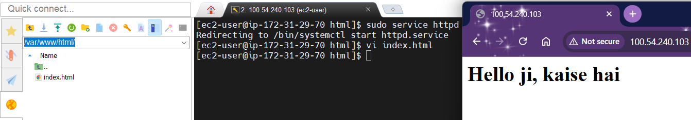
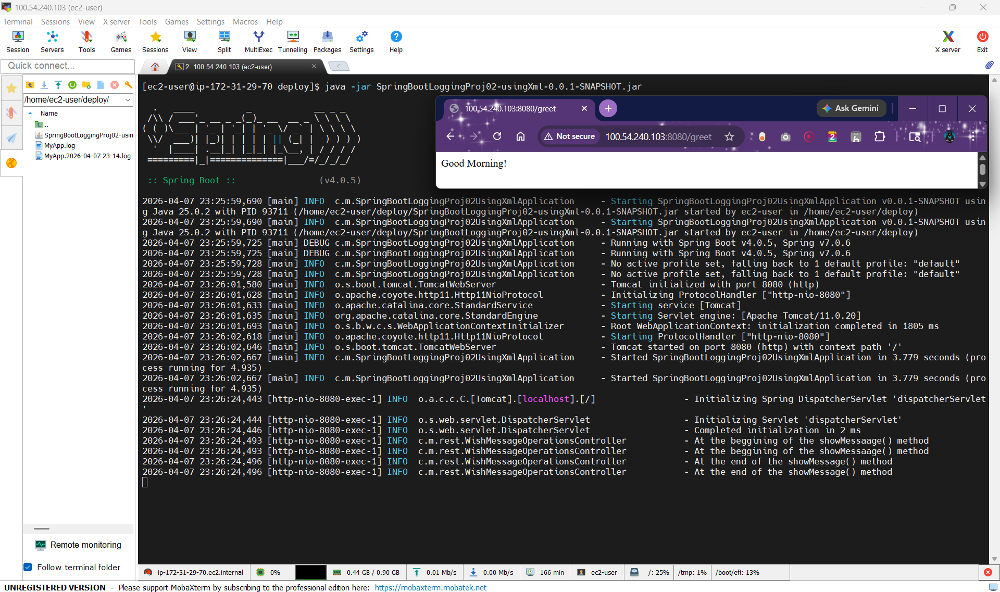
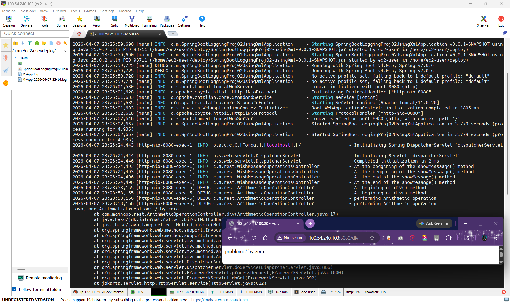
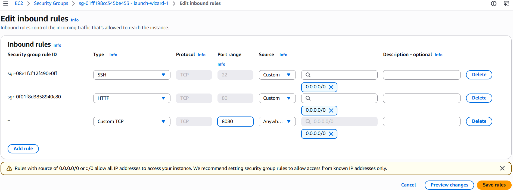

# mvn surefire-report:report is used to generate html report

# mvn site is used to generate documentation

# mvn package is used to create jar/war file to deploy on web

# Deployment
## Deploy Linux

## Deploy SpringBoot Project

## Aws Cfgs

# SonarQube
## for Static Code Review

